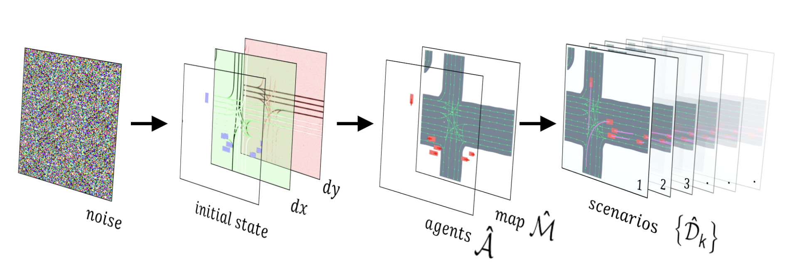

# DriveSceneGen

**[[Paper](https://ieeexplore.ieee.org/abstract/document/10565975)] [[arXiv](https://arxiv.org/abs/2309.14685)] [[Project Page](https://ss47816.github.io/DriveSceneGen/)] [[Code](https://github.com/SS47816/DriveSceneGen)]**

## [RA-L 2024] DriveSceneGen: Generating Diverse and Realistic Driving Scenarios from Scratch



_Shuo Sun<sup>†</sup>, Zekai Gu<sup>†</sup>, Tianchen Sun<sup>†</sup>, Jiawei Sun, Chengran Yuan, Yuhang Han, Dongen Li, and Marcelo H. Ang Jr._

_Advanced Robotics Centre, National University of Singapore_

_<sup>†</sup>Indicates Equal Contribution_

## Abstract

> Realistic and diverse traffic scenarios in large quantities are crucial for the development and validation of autonomous driving systems. However, owing to numerous difficulties in the data collection process and the reliance on intensive annotations, real-world datasets lack sufficient quantity and diversity to support the increasing demand for data. This work introduces DriveSceneGen, a data-driven driving scenario generation method that learns from the real-world driving dataset and generates entire dynamic driving scenarios from scratch. Experimental results on 5k generated scenarios highlight that DriveSceneGen is able to generate novel driving scenarios that align with real-world data distributions with high fidelity and diversity. To the best of our knowledge, DriveSceneGen is the first method that generates novel driving scenarios involving both static map elements and dynamic traffic participants from scratch. Extensive experiments demonstrate that our two-stage method outperforms existing state-of-the-art map generation methods and trajectory simulation methods on their respective tasks.

## Install

1. Clone this repository

```bash
git clone https://github.com/SS47816/DriveSceneGen.git
cd DriveSceneGen
```

2. Install all Dependencies

```bash
make install
conda activate DriveSceneGen
make pip-install
```

## Usage

### Prepare Training Data

1. Download the official [Waymo Motion Dataset](https://waymo.com/open/licensing/?continue=%2Fopen%2Fdownload%2F) to the `./data/raw` directory

2. Preprocess the downloaded data

    ```bash
    python3 DriveSceneGen/scripts/data_preprocess.py
    ```

3. Plot training data

    ```bash
    python3 DriveSceneGen/scripts/data_rasterization.py
    ```

4. Train the diffusion model

    ```bash
    python3 DriveSceneGen/scripts/train.py
    ```
    
5. Generate scenes using your trained diffusion model

    ```bash
    python3 DriveSceneGen/scripts/generation.py
    ```

6. Vectorize the generated scenes

    ```bash
    python3 DriveSceneGen/scripts/vectorization.py
    ```

## BibTeX

If you find our work interesting, please consider citing our paper:

    @ARTICLE{sun2024drivescenegen,
        author={Sun, Shuo and Gu, Zekai and Sun, Tianchen and Sun, Jiawei and Yuan, Chengran and Han, Yuhang and Li, Dongen and Ang, Marcelo H.},
        journal={IEEE Robotics and Automation Letters}, 
        title={DriveSceneGen: Generating Diverse and Realistic Driving Scenarios From Scratch}, 
        year={2024},
        volume={9},
        number={8},
        pages={7007-7014},
        doi={10.1109/LRA.2024.3416792}
    }

## License

This repository is licensed under the [Apache License 2.0](https://github.com/SS47816/DriveSceneGen/blob/main/LICENSE)

<small><p>Project based on <a target="_blank" href="https://github.com/nestauk/ds-cookiecutter">Nesta's data science project template</a>
